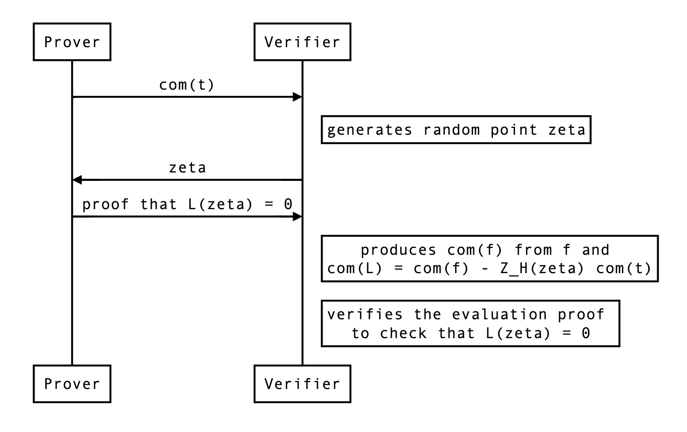

# Maller's optimization for 15-wires

## What is Maller's optimization?

See the [section on Maller's optimization](maller.md) for background.

## If $t$ was not split

We want the verifier to form commitment to the following polynomial:

$$
L(x) = f(x) - Z_H(\zeta) \cdot t(x)
$$

They could do this like so:

$$
com(L) = com(f) - Z_H(\zeta) \cdot com(t)
$$

Since they already know $f$, they can produce $com(f)$, the only thing they need is $com(t)$. So the protocol looks like that:



<!--
```sequence
Prover->Verifier: com(t)
Note right of Verifier: generates random point zeta
Verifier->Prover: zeta
Prover->Verifier: proof that L(zeta) = 0
Note right of Verifier: produces com(f) from f and \n com(L) = com(f) - Z_H(zeta) com(t)
Note right of Verifier: verifies the evaluation proof \n to check that L(zeta) = 0
```
-->

## Inner product stuff

because we use the inner product polynomial commitment we also need $L(\zeta \omega)$ which will be a different value than zero because of the vaniashing polynomial: $L(\zeta \omega) = f(\zeta \omega) - Z_H(\zeta) \cdot t(\zeta \omega) \neq 0$. That evaluation must be sent as well as part of the proof.

## How to deal with $t$?

There's one challenge that prevents us from directly using this approach: $com(t)$ is typically sent and received in several commitments (called chunks or segments throughout the codebase). As $t$ is the largest polynomial, usually exceeding the size of the SRS (which is by default set to be the size of the domain).

### The verifier side

Thus, the **verifier** will have to produce split commitments of $L$ and combine them with powers of $\zeta^n$ to verify an evaluation proof. Let's define $L$ as:

$$
L = L_0 + x^n L_1 + x^{2n} L_1 + \cdots
$$

where every $L_i$ is of degree $n-1$ at most.
Then we have that 

$$
com(L) = com(L_0) + com(x^n \cdot L_1) + com(x^{2n} \cdot L_2) + \cdots
$$

Which the verifier can't produce because of the powers of $x^n$, but we can linearize it as we already know which $x$ we're going to evaluate that polynomial with:

$$
com(\bar L) = com(L_0) + \zeta^n \cdot com(L_1) + \zeta^{2n} \cdot com(L_2) + \cdots
$$

### The prover side

This means that the **prover** will produce evaluation proofs on the following linearized polynomial:

$$
\bar L(x) = 1 \cdot L_0(x) + \zeta^n \cdot L_1(x) + \zeta^{2n} \cdot L_2(x) + \cdots
$$

which is the same as $L(x)$ only if evaluated at $\zeta$. As the previous section pointed out, we will need $\bar L(\zeta \omega)$ and $\bar L(\zeta \omega) \neq L(\zeta \omega)$.

## The actual protocol changes

Now here's how we need to modify the current protocol:

1. The evaluations $f(\zeta), f(\zeta \omega), t(\zeta), t(\zeta \omega)$ don't have to be part of the proof anymore.
2. The prover must still send the chunked commitments to $t$.
3. The prover must create a linearized polynomial $\bar L$ by creating a linearized polynomial $\bar f$ and a linearized polynomial $\bar t$
4. While the verifier knows the evaluation of $\bar L(\zeta)$ (it's supposed to be $0$), they don't know the evaluation of $\bar L(\zeta \omega)$, so the prover needs to send that.
5. The verifier must recreate $com(\bar L)$, the commitment to $\bar L$, themselves so that they can verify the evaluation proofs of both $\bar L(\zeta)$ and $\bar L(\zeta\omega)$.
6. TODO: omega stuff?
7. TODO: Do we still need to check an upperbound on $t$?


<!--
```sequence
Prover->Verifier: com(t) (several of them)
Note right of Verifier: generates random point zeta
Verifier->Prover: zeta
Prover->Verifier: L_bar(zeta * omega) = y
Prover->Verifier: proof that L_bar(zeta) = 0 
Prover->Verifier: proof that L_bar(zeta * omega) = y 
Note right of Verifier: produces com(L_bar)
Note right of Verifier: verifies the evaluation proof \n to check that L_bar(zeta) = 0
```
-->
