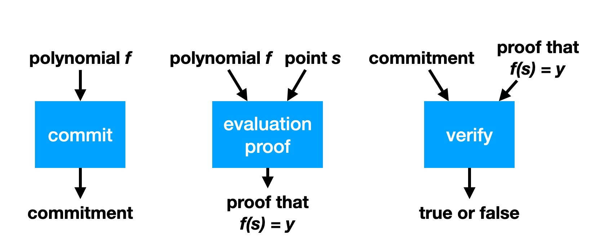

# polynomial commitments

A polynomial commitment is a scheme that allows you to commit to a polynomial (i.e. to its coefficients). Later, someone can ask you to evaluate the polynomial at some point and give them the result, which you can do as well as provide a proof of correct evaluation.

## Schwartz-Zipple lemma

TODO: move this section where most relevant

Let $f(x)$ be a non-zero polynomial of degree $d$ over a field $\mathbb{F}$ of size $n$, then the probability that $f(s)=0$ for a randomly chosen $s$ is at most $\frac{d}{n}$.
