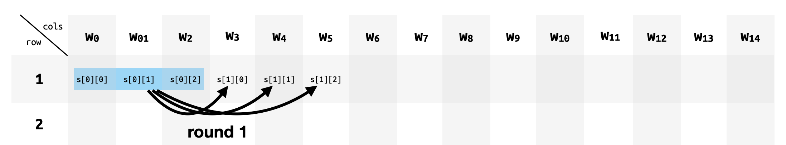
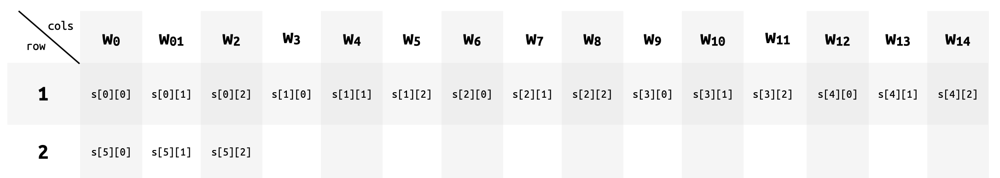
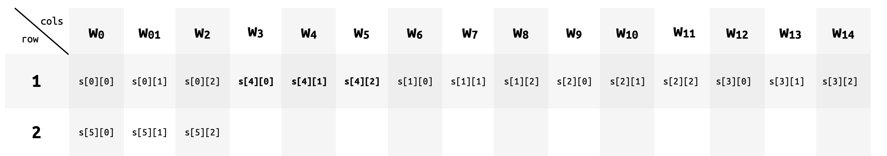

# Poseidon Gate

This is the gate that allows us to implement hashing, via the [Poseidon hash function](../../specs/poseidon.md).

## Wiring

In our version of Poseidon we use a width of 3, which translates to three field elements.
The trick is to use three columns (or cells) to represent these three field elements. The next three columns can then represent the next state, and so on.

The poseidon gate implements 5 rounds of the Poseidon permutation, outputing the final state in the next row. This means that in practice, we implement the 55 rounds of the permutation in 11 rows in the circuit.

## Polynomial

I only have an explanation for the 3-wires polynomial right now, but it translates pretty well to kimchi:

The following polynomial:

$$
f(x) = scalars \cdot psm(x) + alpha^{POS0} \cdot rcm_0(x) + alpha^{POS1} \cdot rcm_1(x) + \alpha^{POS2} \cdot rcm_2(x)
$$

where the $rcm$ polynomials are selector polynomials that take the values of the Poseidon round constants. Why is it three different $rcm$ though when the same round constant is applied to each field element in the state? **TODO: look at the creation of the gate to see how rcm is created**.

where $psm(x)$ is the selector polynomial for Poseidon: it'll be $1$ for rows where a poseidon gate is enabled, and $0$ otherwise.

$$
scalars = \alpha^{POS0} \cdot (\bar{l} - l(\zeta \omega)) + 
\alpha^{POS1} \cdot (\bar r - r(\zeta \omega)) +
\alpha^{POS2} \cdot (\bar o - o(\zeta \omega))
$$

with

* $\bar l = mds[0][0] \cdot l(\zeta)^5 + mds[0][1] \cdot r(\zeta)^5 + mds[0][2] \cdot o(\zeta)^5$
* $\bar r = mds[1][0] \cdot l(\zeta)^5 + mds[1][1] \cdot r(\zeta)^5 + mds[1][2] \cdot o(\zeta)^5$
* $\bar o = mds[2][0] \cdot l(\zeta)^5 + mds[0][1] \cdot r(\zeta)^5 + mds[0][2] \cdot o(\zeta)^5$

so eventually it'll look like this:

$$
\begin{align}
f(x) = & \; psm(x) \cdot [\\
& \;\;\; ((\bar l - l(\zeta \omega) + rcm_0(x)) \cdot \alpha^{POS0} +\\
& \;\;\; ((\bar r - r(\zeta \omega) + rcm_1(x)) \cdot \alpha^{POS1} +\\
& \;\;\; ((\bar o - o(\zeta \omega) + rcm_2(x)) \cdot \alpha^{POS2} +\\
& \;]
\end{align}
$$

**except** that the $rcm_i(x)$ are outside of the multiplication with $psm$, as they don't need to be nullified by $psm$ outside of poseidon gates.

## One last thing

The states are actually not stored contiguously in the first row, the fourth state is re-inserted before the first and second state as shown in the figure below.

This is in case we want to use a permutation with a different number of rounds. If for some reason the last state output on the next row is not the final result, but instead it is the fourth state. (Only the first 7 rows are part of the permutation argument.)
